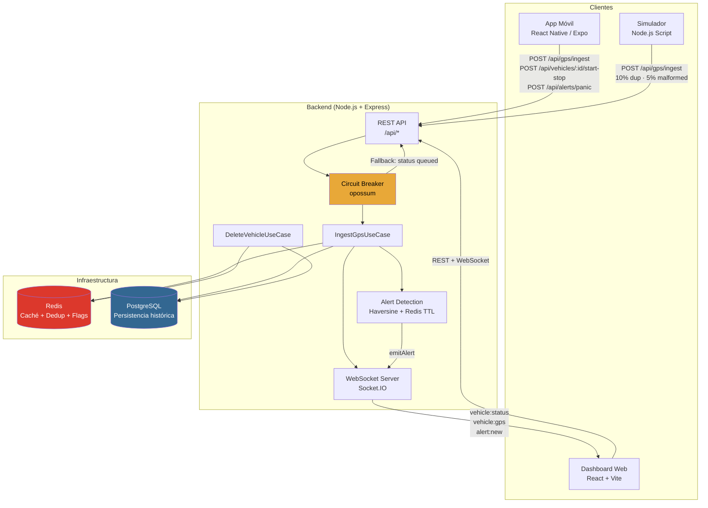

# Sistema de Monitoreo y Telemetría de Flotas

Sistema de telemetría y monitoreo de flotas con GPS en tiempo real. Incluye dashboard web para operadores, backend con arquitectura limpia, simulador de vehículos con inyección de caos y aplicación móvil para conductores.

---

## Demo en producción

El sistema está desplegado y disponible sin necesidad de configuración local:

| Componente | URL |
|---|---|
| Dashboard web | **https://fleet-frontend.onrender.com** |
| Backend API | https://fleet-backend-4esg.onrender.com |

**Credencial de acceso (Superadmin):**
```
ID: SUPER-001
```

Desde el superadmin se pueden crear usuarios flota y conductores. El conductor inicia sesión en la app móvil con su ID único.

> **Nota sobre el tier gratuito de Render**: el backend puede tardar entre 30 y 60 segundos en responder si estuvo inactivo. Pasado ese tiempo inicial, el sistema funciona con normalidad.

> **Vehículos simulados**: el simulador no está desplegado en producción ya que los workers de Render requieren plan de pago. Para ver vehículos en el dashboard, instalar el APK en un dispositivo Android e iniciar un viaje con el conductor creado desde el panel flota. Localmente el simulador sí arranca automáticamente con `docker-compose up`.

**App móvil (APK Android):**

Disponible para descarga directa — no requiere Play Store:
```
https://expo.dev/artifacts/eas/c5gCEFHKr4BKp3jsrA2A1Q.apk
```
Instalar en Android habilitando "Fuentes desconocidas" y usar el ID del conductor asignado para iniciar sesión.

---

## Inicio rápido

### Requisitos previos

| Herramienta | Versión mínima |
|---|---|
| Docker Desktop | 24+ |
| Docker Compose | v2 (incluido con Docker Desktop) |
| Node.js (solo para la app móvil) | 20+ |

### Levantar el sistema completo

```bash
git clone https://github.com/jonathanjaimes/fleet-telemetry.git
cd fleet-telemetry
docker-compose up --build
```

Eso levanta en un solo comando:

| Servicio | URL | Descripción |
|---|---|---|
| Dashboard web | http://localhost:5173 | Panel de control React |
| Backend API | http://localhost:3001 | REST + WebSockets |
| PostgreSQL | localhost:5432 | Persistencia histórica |
| Redis | localhost:6379 | Caché y deduplicación |
| Simulador | — | 5 vehículos virtuales con GPS y caos |

> El simulador arranca automáticamente junto al backend y comienza a enviar coordenadas GPS con un 10 % de peticiones duplicadas y un 5 % con formato erróneo.

### Acceso al dashboard

Al abrir http://localhost:5173 se muestra la pantalla de login.

**Superadmin** (creado automáticamente por las migraciones):

```
ID: SUPER-001
```

Desde el panel de superadmin se crean usuarios flota. Desde el panel flota se crean conductores. El conductor usa su ID único para iniciar sesión en la app móvil.

### Limpiar el entorno

```bash
# Detener sin borrar datos
docker-compose down

# Detener y borrar volúmenes (base de datos incluida)
docker-compose down -v
```

---

## App móvil para conductores

La app móvil es opcional en cuanto a instrucciones de levantamiento del jurado, pero está completamente funcional. Para probarla:

**Requisitos adicionales:**
- Expo Go instalado en el dispositivo físico (Android o iOS)
- Cloudflare Tunnel: `brew install cloudflare/cloudflare/cloudflared` (macOS) o [descargar en cloudflare.com](https://developers.cloudflare.com/cloudflare-one/connections/connect-networks/downloads/)

```bash
# 1. Exponer el backend con Cloudflare Tunnel (en una terminal aparte, con Docker corriendo)
cloudflared tunnel --url http://localhost:3001
# Aparecerá una URL tipo https://xxxx.trycloudflare.com

# 2. Configurar la app
cd mobile
cp .env.example .env
# Editar .env y pegar la URL de Cloudflare en EXPO_PUBLIC_BACKEND_URL
# EXPO_PUBLIC_BACKEND_URL=https://xxxx.trycloudflare.com

# 3. Instalar dependencias e iniciar
npm install
npx expo start --tunnel --clear
```

Escanear el QR con Expo Go desde el dispositivo.

> **Nota**: se usa Cloudflare Tunnel para exponer el backend porque no requiere cuenta ni tiene límite de sesiones simultáneas. El tunnel de Expo (`--tunnel`) usa ngrok internamente solo para servir el bundle de JavaScript al dispositivo — ambos servicios coexisten sin conflicto.

---

## Diagrama de arquitectura



---

## Arquitectura de software

### Decisión: Clean Architecture en el backend

El backend se organiza en tres capas con dependencias que solo van hacia adentro:

```
domain/        ← Entidades e interfaces (sin dependencias externas)
application/   ← Casos de uso (orquestan la lógica de negocio)
infrastructure/← Implementaciones concretas (PostgreSQL, Redis, Socket.IO)
api/           ← Controladores Express (entrada HTTP)
```

**Por qué esta decisión:** la lógica de detección de vehículos detenidos, deduplicación y generación de alertas está completamente aislada en `IngestGpsUseCase` y las entidades de dominio. Cambiar la base de datos de PostgreSQL a MongoDB, o sustituir Redis por Memcached, no requiere tocar una sola línea de lógica de negocio.

### Decisión: Feature-based architecture en el frontend

El frontend se organiza por funcionalidades (`features/map`, `features/vehicles`, `features/routes`) en lugar de por tipo de archivo. Esto reduce el acoplamiento entre módulos y hace que cada feature sea autocontenida con su propio componente, estado local y estilos.

### Decisión: Zustand sobre Redux

Zustand ofrece un API mínima sin boilerplate, soporte nativo para selectores granulares (evita re-renders innecesarios) y es compatible con React 18 sin configuración adicional. Para el tamaño de este proyecto, Redux añadiría complejidad sin beneficio real.

### Decisión: Leaflet sobre Google Maps

Leaflet es open-source y no requiere clave de API, lo que elimina un punto de fallo para evaluadores que levanten el proyecto sin credenciales configuradas. La funcionalidad requerida (marcadores, polilíneas, popups) está completamente cubierta.

### Decisión: PostgreSQL + Redis (no solo uno de los dos)

Redis resuelve la deduplicación en microsegundos y gestiona los flags de estado transitorio del vehículo (`manual_stop`, `stopped_since`, `deleted`). PostgreSQL garantiza la persistencia histórica y las relaciones entre usuarios, vehículos, alertas y rutas. Usar solo uno de los dos implicaría sacrificar rendimiento o durabilidad.

---

## Tolerancia a fallos

### Circuit Breaker

El ingreso de coordenadas GPS pasa por un Circuit Breaker implementado con `opossum`:

- **Umbral de error:** 50 % de fallos en los últimos llamados
- **Volumen mínimo:** 5 llamadas antes de poder abrir el circuito
- **Timeout por llamada:** 3 s
- **Tiempo de recuperación:** 30 s en estado `OPEN` antes de intentar `HALF-OPEN`
- **Fallback:** devuelve `{ status: 'queued' }` para no bloquear al cliente

### Anti-duplicados

Cada lectura GPS genera una clave determinista `dedup:{vehicle_id}:{lat}:{lng}:{timestamp_ms}` que se almacena en Redis con un TTL de 10 segundos. Si llega la misma clave antes de que expire, se rechaza con HTTP 409.

### Eliminación consistente (patrón Saga simplificado)

Al eliminar un vehículo:
1. Se elimina de Redis (caché + flags)
2. Se elimina de PostgreSQL
3. Se activa un flag `deleted:{vehicle_id}` con TTL de 30 segundos para que lecturas GPS tardías en vuelo sean rechazadas sin escribir en DB

Si el proceso falla entre los pasos 2 y 3, el flag impide que el vehículo "resucite" por mensajes GPS en tránsito.

### Validación de datos GPS entrantes

La función `isValidGpsReading` aplica el patrón Specification sobre cada petición:
- `vehicle_id` debe ser cadena no vacía
- `lat` debe ser número en `[-90, 90]`
- `lng` debe ser número en `[-180, 180]`
- `timestamp` debe ser cadena ISO 8601 válida

Las peticiones malformadas retornan HTTP 400 sin llegar a la capa de casos de uso.

---

## Detección de inactividad (lógica de negocio)

El sistema usa la fórmula de **Haversine** para calcular la distancia real entre coordenadas. Un desplazamiento menor a 25 metros se considera drift del GPS y no se contabiliza como movimiento.

| Tiempo sin movimiento real | Acción |
|---|---|
| < 30 s | Sin cambio de estado |
| 30 s – 120 s | Estado `idle` (vehículo quieto, viaje activo) |
| ≥ 120 s | Estado `alert` + alerta `VEHICLE_STOPPED` emitida |

---

## Retos de arquitectura móvil

### Offline First — ¿qué pasa si el conductor pierde conexión por 10 minutos?

**Estrategia adoptable en producción:**

1. **Cola local persistente:** al perder conectividad, las lecturas GPS se encolan en SQLite (o `AsyncStorage` para volúmenes bajos) con su timestamp real. No se descarta ningún dato.

2. **Sincronización diferida con backpressure:** al recuperar señal, el cliente envía el lote en chunks de 50 lecturas con un delay de 200 ms entre cada uno. Esto evita saturar el endpoint de ingesta con un burst de 600 lecturas acumuladas.

3. **Idempotencia garantizada:** el mecanismo de deduplicación por clave `dedup:{vehicle_id}:{lat}:{lng}:{timestamp_ms}` ya garantiza que reenviar el mismo dato es seguro. El servidor simplemente devuelve HTTP 409 sin efecto secundario.

4. **Resolución de conflictos:** dado que el timestamp es el del dispositivo (no del servidor), el historial histórico se reconstruye con precisión real incluso si llega con minutos de retraso.

**Implementación actual (prototipo):** la app muestra alertas locales de "No se pudo enviar — guardando localmente" pero aún no persiste en SQLite. En producción, `expo-sqlite` o `@op-engineering/op-sqlite` cubren esto.

### Batería — estrategias para reducir el consumo del GPS

| Estrategia | Descripción | Impacto |
|---|---|---|
| **Adaptive polling** | Reducir la frecuencia de lectura GPS de 1 s a 5–15 s cuando el acelerómetro detecta que el dispositivo está estático | Alto |
| **Geofencing** | Usar las APIs nativas de geofencing (iOS `CLRegion`, Android `GeofencingClient`) para detectar entrada/salida de zonas sin activar el GPS continuamente | Alto |
| **Significant Location Changes** | En iOS, usar `startMonitoringSignificantLocationChanges` que solo notifica cuando hay cambios de celda telefónica | Medio |
| **Background fetch con baja frecuencia** | Solicitar ubicación cada 30 s en background en lugar de streaming continuo | Medio |
| **Batching** | Acumular 10 lecturas y enviarlas en un solo POST en lugar de 10 requests separados | Bajo (red) |

En el prototipo actual la lectura es continua para facilitar la evaluación. En producción se implementaría adaptive polling como primera prioridad, dado que la mayoría de vehículos pasan un porcentaje alto del tiempo detenidos en semáforos o en carga/descarga.

---

## Reporte de IA

**Herramienta principal:** Cursor con Claude (Sonnet).

### ¿Para qué se usó?

| Tarea | Descripción |
|---|---|
| Generación de boilerplate repetitivo | Estructura inicial de archivos, tipos TypeScript auxiliares, CSS repetitivo entre componentes |
| Escritura de tests unitarios | Una vez definidos los contratos de dominio, la IA ayudó a redactar los casos de prueba bajo revisión y corrección manual |
| Configuración de docker-compose y Dockerfiles | Variables de entorno, healthchecks, orden de dependencias entre servicios |
| Corrección de errores de TypeScript | Errores de tipado en rutas Express y castings de módulos externos |
| Redacción de mensajes de commit | La IA generó el copy descriptivo de los commits a partir del contexto de cada cambio, manteniendo consistencia en el historial del repositorio |

### Alucinación encontrada y cómo se corrigió

Al asistir con la escritura de los tests de `IngestGpsUseCase`, la IA generó aserciones que comparaban el `id` de la alerta con un valor fijo (`'uuid-1234'`), ignorando que el ID se genera dinámicamente con `uuidv4()` en cada ejecución. El test fallaba en cada corrida. La corrección fue reemplazar la comparación directa por `expect.objectContaining({ vehicle_id, type, resolved })`, que valida los campos de negocio relevantes sin acoplarse al valor aleatorio del identificador.

En la generación de boilerplate del `docker-compose.yml`, la IA configuró el servicio del simulador con `depends_on: backend` sin condición de salud, lo que provocaba que el simulador arrancara antes de que el backend estuviera listo para recibir peticiones y fallara al intentar conectarse. La corrección fue agregar `condition: service_healthy` al backend y definir el healthcheck correspondiente en `GET /health`, garantizando el orden de arranque correcto.

---

## Desafíos y soluciones

### Carrera entre GPS tardío y parada manual

**Problema:** el conductor presiona "Finalizar viaje" en la app móvil, pero hay paquetes GPS en tránsito que llegan milisegundos después y pisan el estado `stopped` con `moving`.

**Solución:** flag `manual_stop:{vehicle_id}` en Redis con TTL de 30 s. El `IngestGpsUseCase` verifica el flag al inicio; si está activo, emite el update GPS pero no modifica el estado del vehículo en DB.

### Re-alertas inmediatas al resolver VEHICLE_STOPPED

**Problema:** el operador resuelve una alerta de inactividad desde el dashboard, pero el vehículo sigue en la misma posición. El siguiente paquete GPS genera otra alerta de inmediato.

**Solución:** al resolver la alerta, se llama `clearStoppedSince` que borra el timestamp de Redis. El temporizador de inactividad reinicia desde cero, dando un margen de 2 minutos antes de que pueda generarse una nueva alerta.

### Eliminación de vehículo con GPS en vuelo

**Problema:** el vehículo es eliminado por el operador, pero el simulador (o la app) ya tiene paquetes GPS enviados que aún no procesó el servidor. Estos "resucitan" el vehículo en DB.

**Solución:** flag `deleted:{vehicle_id}` con TTL de 5 minutos. El `IngestGpsUseCase` lo consulta al inicio antes de cualquier otra operación y retorna `duplicate` sin efecto secundario.

### Movimiento real vs. drift del GPS

**Problema:** el GPS de un dispositivo estático reporta coordenadas que varían entre sí por 10–30 metros, lo que el sistema interpretaría como movimiento constante, nunca generando alertas de inactividad.

**Solución:** umbral de 25 metros calculado con la fórmula de Haversine. Solo distancias superiores a este umbral cuentan como movimiento real del vehículo.

### ¿Qué haría diferente con más tiempo o recursos?

- **CQRS explícito:** separar el modelo de escritura (ingesta GPS) del modelo de lectura (dashboard), optimizando cada uno de forma independiente con proyecciones materializadas.
- **Message broker:** reemplazar el broadcast directo de Socket.IO con una cola (Kafka o RabbitMQ) para desacoplar productores y consumidores, soportar replay de eventos y escalar horizontalmente.
- **SQLite offline en la app móvil:** implementar la cola local con `expo-sqlite` para Offline First real, con un worker de sincronización que envíe el backlog en background al recuperar conectividad.
- **GitHub Actions CI/CD:** pipeline que ejecute los tests, construya las imágenes Docker y las publique en un registry antes de cada merge a main.
- **Observabilidad:** métricas con Prometheus + Grafana y trazas distribuidas con OpenTelemetry para monitorear latencias de ingesta y tasas de Circuit Breaker en producción.

---

## Video de sustentación

**[Ver en YouTube](https://youtu.be/XHEs8c9Ym-M)**

Duración: 5–10 minutos. Cubre la arquitectura elegida, demostración en vivo del sistema (dashboard + app móvil) y justificación de las decisiones técnicas principales.

---

## Estructura del repositorio

```
fleet-telemetry/
├── backend/                    # API Node.js + TypeScript (Clean Architecture)
│   ├── src/
│   │   ├── domain/             # Entidades e interfaces (sin dependencias externas)
│   │   ├── application/        # Casos de uso y reglas de negocio
│   │   ├── infrastructure/     # PostgreSQL, Redis, Socket.IO, Circuit Breaker
│   │   ├── api/                # Controladores Express y rutas
│   │   └── simulator/          # Script de simulación con inyección de caos
│   ├── Dockerfile
│   └── Dockerfile.simulator
├── frontend/                   # Dashboard React + Vite + TypeScript
│   ├── src/
│   │   ├── features/           # Organización por funcionalidad (map, vehicles, routes)
│   │   ├── store/              # Estado global con Zustand
│   │   ├── pages/              # LoginPage, FleetPage, SuperAdminPage
│   │   └── hooks/              # useTheme, useFleetSocket
│   └── Dockerfile
├── mobile/                     # App conductores React Native / Expo
│   ├── src/
│   │   ├── hooks/              # useTelemetry, useAppTheme
│   │   ├── context/            # ThemeContext
│   │   └── theme/              # Paleta de colores dark/light
│   └── App.tsx
└── docker-compose.yml
```
